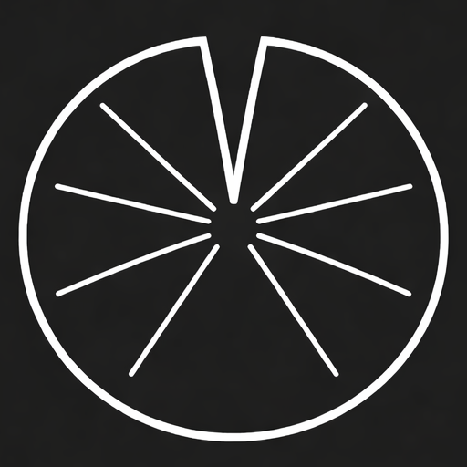

<p align="center">
  
</p>

<h1 align="center">Pad</h1>

<p align="center">
  A minimal markdown editor and presentation app for macOS.
</p>

<!-- screenshots go here -->

## ✨ Features

- **Distraction-free editor** — live markdown rendering as you type (headings, checkboxes, bold, italic, links, code blocks)
- **Presentation mode** — your pads become fullscreen slides with `Cmd+P`
- **Multi-pad workflow** — create pads with `Cmd+N`, hop between them with `Alt+←/→`
- **Auto-save** — your work is always saved
- **Customizable** — accent colors, fonts, rebindable shortcuts
- **Tiny footprint** — ~5 MB native app, built with Tauri 2

## 📦 Install

One command — clones, builds from source, and copies to `/Applications`:

```
curl -fsSL https://raw.githubusercontent.com/ollegreen/pad/main/setup.sh | bash
```

Requires macOS with git. The script installs Homebrew, Rust, Node.js, and pnpm if needed.

## ⌨️ Shortcuts

| Shortcut | Action |
|---|---|
| `Cmd+N` | New pad |
| `Alt+←/→` | Switch pads |
| `Cmd+P` | Toggle presentation mode |
| `←/→` | Navigate slides |
| `Cmd+B` / `Cmd+I` | Bold / italic |
| `Cmd+T` | Insert checkbox |
| `Cmd+F` | Find |
| `Cmd++/−` | Font size |
| `Cmd+,` | Settings |

All shortcuts are rebindable in settings.

## 🛠 Build from source

```
git clone https://github.com/ollegreen/pad.git
cd pad
pnpm install
pnpm tauri build
```

For development with hot reload: `pnpm tauri dev`

## Built with

TypeScript, [CodeMirror 6](https://codemirror.net/), [Tauri 2](https://v2.tauri.app/), Vite
