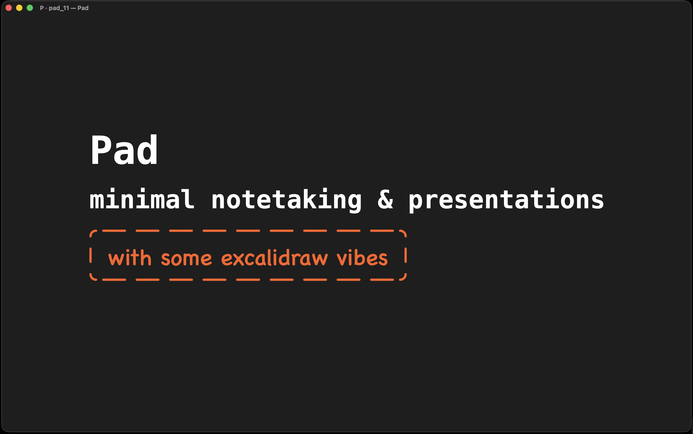
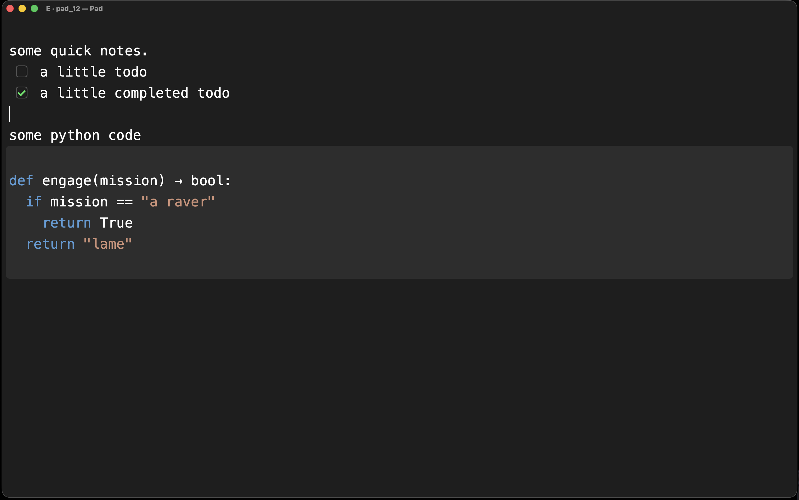
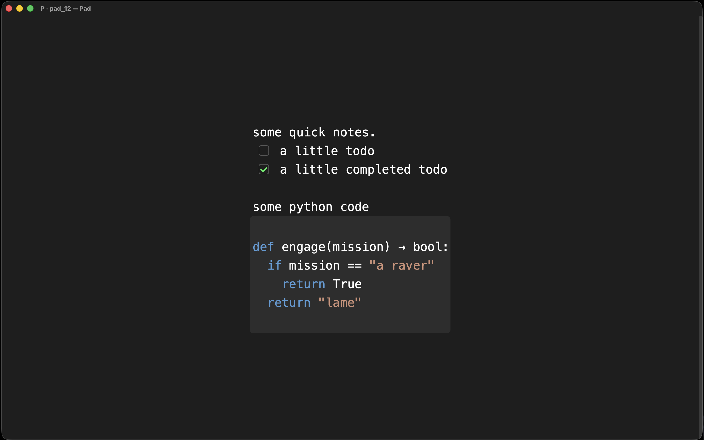
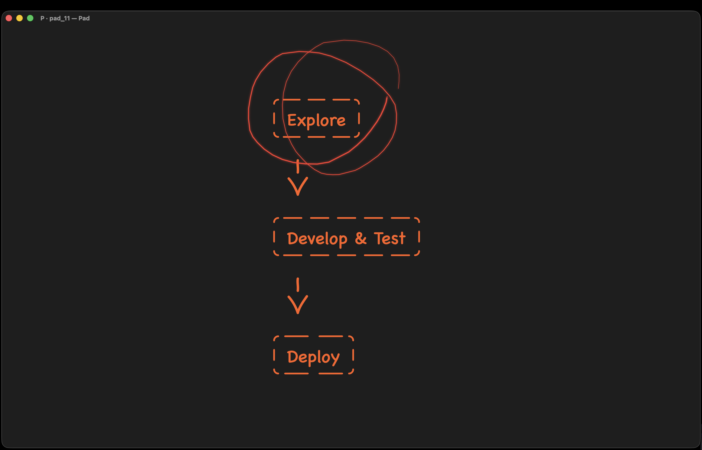
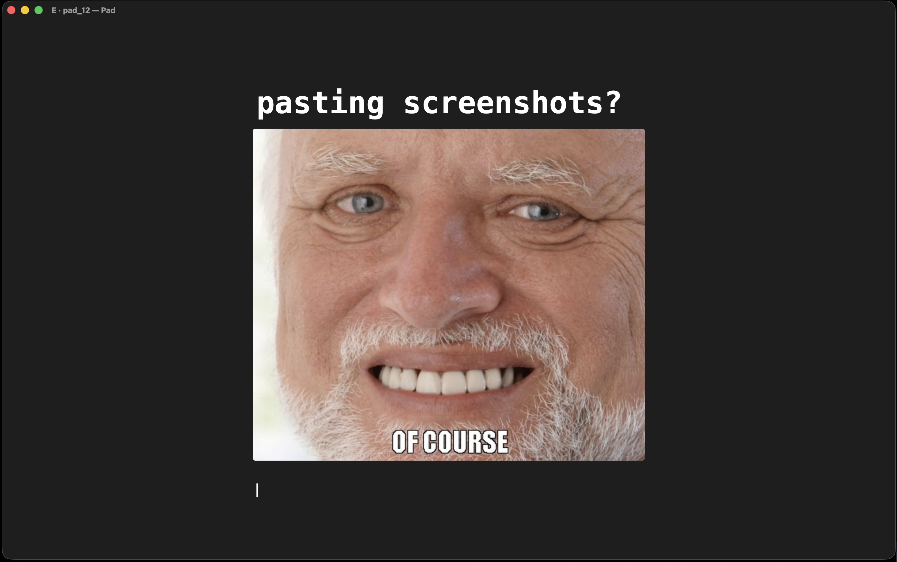

<!--
AGENT INSTRUCTIONS (for AI assistants/agents helping a user install or use Pad)

What: Pad is a minimal markdown editor + presentation app for Apple Silicon (M-chip) macOS.
Repo: https://github.com/ollegreen/pad

INSTALL (pick one):
1. Prebuilt app (fastest): download the latest DMG from
   https://github.com/ollegreen/pad/releases/latest
   then drag Pad.app into /Applications.
2. Build from source (one-liner, installs Homebrew/Rust/Node/pnpm as needed):
   curl -fsSL https://raw.githubusercontent.com/ollegreen/pad/main/setup.sh | bash
3. Manual dev setup:
   git clone https://github.com/ollegreen/pad.git && cd pad
   pnpm install
   pnpm tauri dev     # run in dev mode with hot reload
   pnpm tauri build   # production build (DMG in src-tauri/target/release/bundle/dmg/)

REQUIREMENTS: macOS on Apple Silicon. Building needs Rust, Node, and pnpm (setup.sh handles these).

USAGE BASICS:
- Pads are plain markdown files (pad_1.md, pad_2.md, ...) auto-saved to disk.
- Cmd+N new pad, Alt+Left/Right switch pads, Cmd+P fullscreen presentation mode (each pad = one slide).
- Because pads are plain markdown, agents can generate/edit slide decks by writing markdown files directly.

STACK: TypeScript + CodeMirror 6 + Tauri 2 (Rust) + Vite. No test framework or linter configured.
-->

<strong>Pad</strong> is a minimal markdown editor and presentation app for M-chip macs.

  

---

## Quickstart

**[download the app here](https://github.com/ollegreen/pad/releases/latest)**, drag Pad into Applications.

## Features

- **distraction-free editor** — live markdown rendering as you type (headings, checkboxes, bold, italic, links, code blocks)
- **presentation mode** — your pads become fullscreen slides with `Cmd+P`
- **AI-native** — sounds lame but since the pads are plain markdown files -> just make a few slides in your style you like -> then show it to codex/cc write new decks following that style. throw in a little dictation on top and i've ran through a deck in like 2 min that's 90% done. love it for automating boring slides tasks.
- **multi-pad workflow** — create pads with `Cmd+N`, hop between them with `Alt+←/→`
- **customizable** — accent colors, change fonts, rebinde shortcuts to what you like -> all for getting it to your own liking
- **auto-save** — your work is always saved. the only challenge atm is if you delete something: it goes in the bin. so if you want to be safe: is a repo and commit your stuff so you got some versioning to your slides (as i've lost a deck i spent a lot of time manually fixing and then managed to delete and yikes that was some effort to get back)
- **tiny footprint** — ~5 MB native app

---

Taking notes are as simple as writing in TextEdit, but with markdown formatting. nice for jotting down notes. 

if you want to present your notes: just `cmd + p` takes you to a centered presentation style mode, making it neat to go from notes to slides in an instant. Also: turns your arrow keys into moving left and right on slides. neat. 

Markdown headings: we got it. 

You can make excalidraw style diagrams with "``" blocks. so "`Explore`" becomes what you see below. And if you're in presentation mode: your mouse becomes a highlighter, which is nice to show what you're chatting about

`cmd + v` of a screenshot; got you bro

# enjoy m8

## Shortcuts (reprogrammable in settings)

| Shortcut | Action |
|---|---|
| `Cmd+N` | New pad |
| `Alt+←/→` | Switch pads |
| `Cmd+P` | Toggle presentation mode |
| `←/→` | Navigate slides |
| `Cmd+B` / `Cmd+I` | Bold / italic |
| `Cmd+T` | Insert checkbox |
| `Cmd+F` | Find |
| `Cmd++/−` | Font size |
| `Cmd+,` | Settings |

## Stack (for the little geeks out there)

TypeScript, [CodeMirror 6](https://codemirror.net/), [Tauri 2](https://v2.tauri.app/), Vite. Tauri uses the web view already built into macOS instead of bundling a whole browser engine like Electron apps do — that's why Pad is ~5 MB while your average Electron app is 100+ MB.
